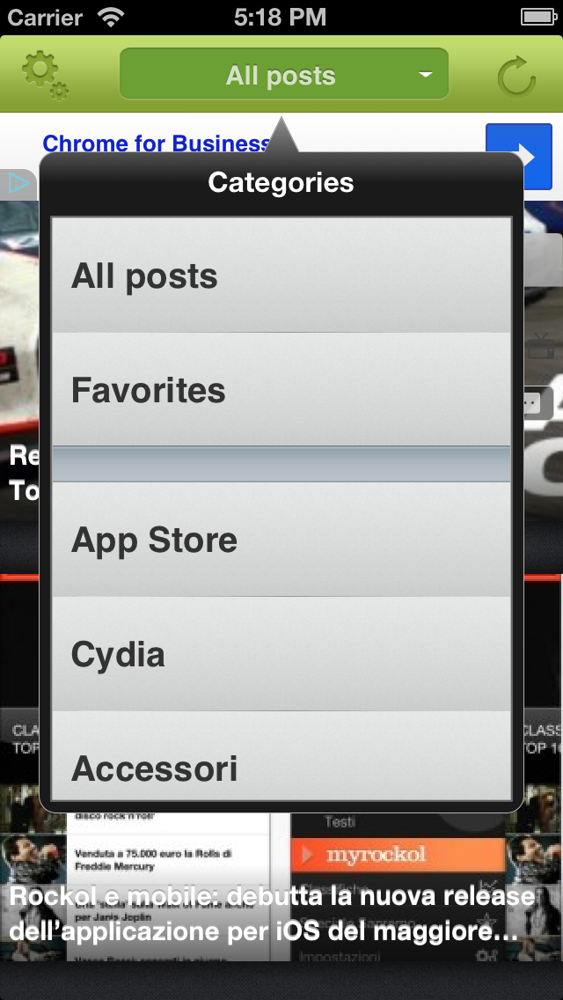
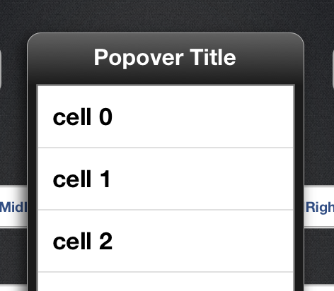
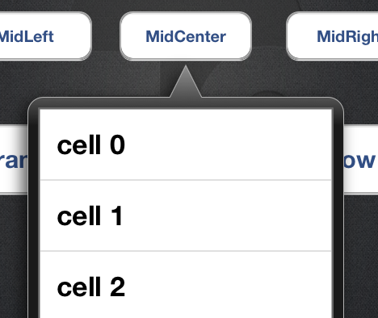
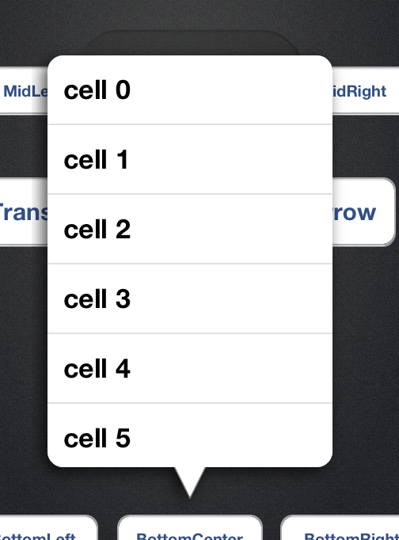

FPPopover
========
This library provides an alternative to the native iOS UIPopoverController, 
adding support for iPhone and additional opportunities to customize the look and feel of the popovers.

The development started as first as a [Mobiloud](http://www.mobiloud.com) open source component, after some commits we realized was a appreciated library so I decided to continue the development, also the development is continuing thank to your feedbacks and pull requests!




Features
========

* Works like UIPopoverController.
* Runs on both iPhone and iPad.
* Popover rendered using no images, only Quartz code.
* Customize the look of popovers (color, dimensions).
* Automatic orientation. It will find the best orientation and size for every situation.
* Can draw popover with no arrows
* Borderless popover
* MIT License (you can use it for commercial apps, edit and redistribute).
* Using ARC (see [ARC-Support](https://github.com/50pixels/FPPopover/wiki/ARC-support))

What you need
---

To use FPPopoverController you only need

* FPPopoverController.m and .h    (the controller)
* FPPopoverView.m and .h
* FPTouchView.m and .m
* ARCMacros.h  

That's it.


How to use it
---  

Let's start with a simple example

```objective-c
-(IBAction)buttonClicked:(UIButton*)okButton
{
    //the view controller you want to present as popover
    YourViewController *controller = [[YourViewController alloc] init]; 

    //our popover
    FPPopoverController *popover = [[FPPopoverController alloc] initWithViewController:controller]; 
    
    //the popover will be presented from the okButton view 
    [popover presentPopoverFromView:okButton]; 

    //no release (ARC enable)
    //[controller release];
}
```
    
This will display a black popover with automatic arrow positioning and a maximum of 200x300 content size and no delegate messages.

The title of YourViewController (controller.title) will be presented on the top.

##Customize the size

Default content size is 200x300. This can be set using the following property
```objective-c
popover.contentSize = CGSizeMake(150,200);
```

This property defines a maximum boundary for content, but the actual content area displayed may
vary according to the what is found to be the optimal size to fit the popover on the screen (e.g. when adjusting the layout from portrait to landscape mode).


##Customize the tint

* FPPopoverBlackTint  (default)
* FPPopoverLightGrayTint
* FPPopoverGreenTint
* FPPopoverRedTint

```objective-c
popover.tint = FPPopoverRedTint;
```

Contact us if you need more tints!

##Force the arrow direction

If you need to force the arrow direction use the arrowDirection property

```objective-c
popover.arrowDirection = FPPopoverArrowDirectionUp;
```

##No arrow
If you want a popover like a popup, with no arrow

```objective-c
popover.arrowDirection = FPPopoverNoArrow;
```


##No title

```objective-c
//the view controller you want to present as popover
YourViewController *controller = [[YourViewController alloc] init]; 
controller.title = nil;
```



##Borderless popover

```objective-c
popover.border = NO;
popover.tint = FPPopoverWhiteTint;
```



## Transparency 
If you want to change alpha channel and handle the transparency of the popover

```objective-c
popover.alpha = 0.8;
```


##Delegate messages

Set your delegate

```objective-c    
YourViewController *controller = [[YourViewController alloc] init]; 
FPPopoverController *popover = [[FPPopoverController alloc] initWithViewController:controller]; 
popover.delegate = controller;
....
```

In this case we are setting up the YourViewController as our popover delegate.

####Know when a new popover is displayed
```objective-c
- (void)presentedNewPopoverController:(FPPopoverController *)newPopoverController 
          shouldDismissVisiblePopover:(FPPopoverController*)visiblePopoverController;
```

Use this delegate method to know when a new different popover is displayed. If you want to dismiss the old popover, and release it, send the dismiss message inside this method.

```objective-c
- (void)presentedNewPopoverController:(FPPopoverController *)newPopoverController 
          shouldDismissVisiblePopover:(FPPopoverController*)visiblePopoverController
{
    [visiblePopoverController dismissPopoverAnimated:YES];
    [visiblePopoverController autorelease];
}
```

####Know when the popover is dismissed

```objective-c
    - (void)popoverControllerDidDismissPopover:(FPPopoverController *)popoverController;
```

Use this delegate method to know when the popover is dismissed. This could happen when the user taps outside the popover or when a dismiss message is sent by other actions.

## Contributors

Thank you to the following wonderful people for contributing:
alphabetically sorted

 * [@avolovoy](https://github.com/avolovoy)
 * [@johnlinvc](https://github.com/johnlinvc)
 * [@markd2](https://github.com/markd2)
 * [@markrickert](https://github.com/markrickert)
 * [@romanr](https://github.com/romanr)
 * [@RubenSandwich](https://github.com/RubenSandwich)
 
 

